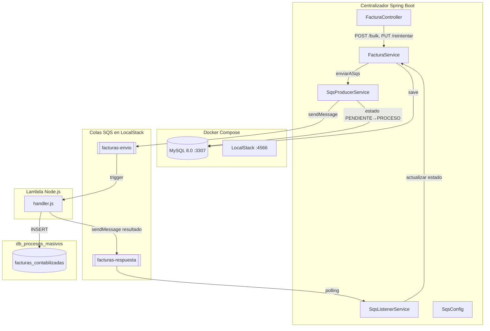
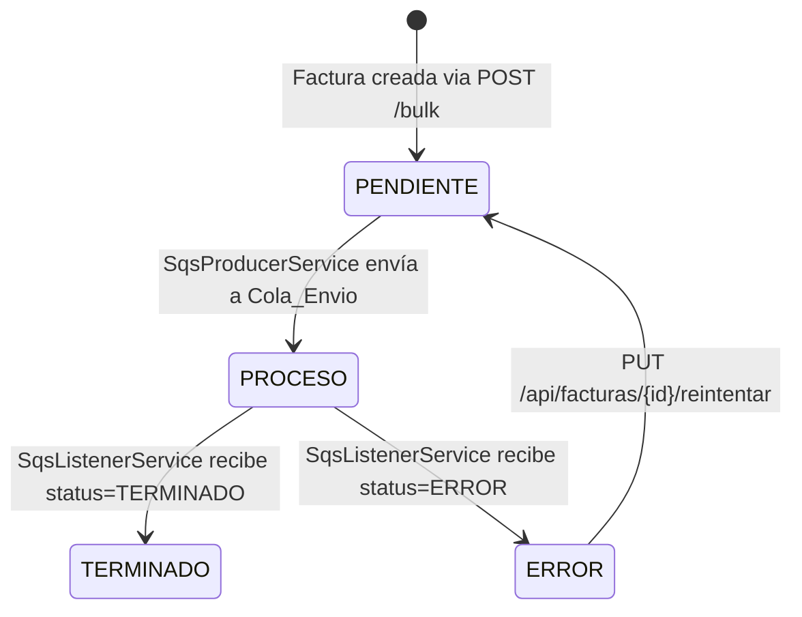

# Diseño: HU-03 — Envío a SQS y Actualización de Estados

## Visión General

Esta historia implementa la integración asíncrona entre el Centralizador (Spring Boot) y una Lambda Node.js mediante dos colas SQS: una de envío (`facturas-envio`) y una de respuesta (`facturas-respuesta`). El flujo orquesta el ciclo de vida completo de contabilización: envío de facturas PENDIENTE a SQS, procesamiento por Lambda con inserción en `db_procesos_masivos.facturas_contabilizadas`, y actualización de estados según la respuesta recibida. Se incluye infraestructura local con LocalStack en Docker Compose y un endpoint de reintento para facturas en ERROR.

### Diagrama de Arquitectura



### Diagrama de Estados



## Arquitectura

Se extiende la arquitectura de capas existente (Controller → Service → Repository) con dos nuevos servicios transversales:

- **SqsProducerService**: Envía mensajes a la cola de envío usando AWS SDK v2 para Java (`software.amazon.awssdk:sqs`). Se invoca desde `FacturaService` después de la creación masiva.
- **SqsListenerService**: Hilo de polling con `@Scheduled` que consulta la cola de respuesta periódicamente, deserializa la respuesta JSON y delega la actualización de estado a `FacturaService`.
- **SqsConfig**: Bean de configuración que crea el `SqsClient` apuntando a LocalStack.
- **Lambda Node.js**: Función desplegada en LocalStack que consume de la cola de envío, inserta en `db_procesos_masivos.facturas_contabilizadas` y envía resultado a la cola de respuesta.

### Decisiones de Diseño

1. **AWS SDK v2 (software.amazon.awssdk:sqs)** en lugar de Spring Cloud AWS: menor acoplamiento, control directo del cliente SQS, sin dependencias transitivas pesadas.
2. **@Scheduled polling** en lugar de listener reactivo: simplicidad para el contexto de hackathon, fácil de depurar, sin necesidad de infraestructura adicional.
3. **Validación de transiciones de estado en el servicio**: la lógica de máquina de estados se centraliza en `FacturaService` con un método `validarTransicion()` que rechaza transiciones no permitidas.
4. **Lambda con mysql2**: driver MySQL nativo para Node.js, ligero y compatible con LocalStack.
5. **LocalStack con init script**: las colas SQS y la Lambda se crean automáticamente al levantar Docker Compose mediante un script bash montado en `/etc/localstack/init/ready.d/`.

## Componentes e Interfaces

### 1. Docker Compose — Servicio LocalStack

Se agrega el servicio `localstack` al `docker-compose.yml` existente:

```yaml
localstack:
  image: localstack/localstack:3.5
  container_name: centralizador-localstack
  ports:
    - "4566:4566"
  environment:
    SERVICES: sqs,lambda
    DEFAULT_REGION: us-east-1
    LAMBDA_EXECUTOR: local
    DOCKER_HOST: unix:///var/run/docker.sock
  volumes:
    - ./docker/localstack:/etc/localstack/init/ready.d
    - /var/run/docker.sock:/var/run/docker.sock
    - ./docker/lambda:/opt/lambda
  healthcheck:
    test: ["CMD", "curl", "-f", "http://localhost:4566/_localstack/health"]
    interval: 10s
    timeout: 5s
    retries: 5
```

### 2. Script de inicialización LocalStack

Archivo: `proyecto/docker/localstack/init-aws.sh`

```bash
#!/bin/bash
awslocal sqs create-queue --queue-name facturas-envio
awslocal sqs create-queue --queue-name facturas-respuesta

# Desplegar Lambda
cd /opt/lambda
zip -r function.zip index.mjs
awslocal lambda create-function \
  --function-name lambda-contabilizadora \
  --runtime nodejs20.x \
  --handler index.handler \
  --zip-file fileb://function.zip \
  --role arn:aws:iam::000000000000:role/lambda-role \
  --environment "Variables={DB_HOST=centralizador-mysql,DB_PORT=3306,DB_USER=root,DB_PASSWORD=root123,DB_NAME=db_procesos_masivos,SQS_RESPONSE_URL=http://sqs.us-east-1.localhost.localstack.cloud:4566/000000000000/facturas-respuesta}"

# Mapear cola de envío como trigger de la Lambda
awslocal lambda create-event-source-mapping \
  --function-name lambda-contabilizadora \
  --event-source-arn arn:aws:sqs:us-east-1:000000000000:facturas-envio \
  --batch-size 1
```

### 3. SqsConfig.java — Configuración del cliente SQS

```java
package com.hackathon.centralizador.config;

@Configuration
public class SqsConfig {

    @Bean
    public SqsClient sqsClient(
            @Value("${aws.sqs.endpoint}") String endpoint,
            @Value("${aws.region}") String region) {
        return SqsClient.builder()
                .endpointOverride(URI.create(endpoint))
                .region(Region.of(region))
                .credentialsProvider(StaticCredentialsProvider.create(
                        AwsBasicCredentials.create("test", "test")))
                .build();
    }
}
```

### 4. SqsMessageDto.java — DTO del mensaje de envío

```java
package com.hackathon.centralizador.dto;

public record SqsMessageDto(
    Long facturaId,
    String cus,
    String fechaPago,        // ISO-8601
    String responsabilidadFiscal,
    String tipoDocumento,
    String numeroDocumento,
    String nombres,
    String apellidos,
    String telefono,
    String municipio,
    String direccion,
    String email,
    BigDecimal valorPack,
    BigDecimal valorPackIva,
    String comentarios
) {}
```

### 5. SqsResponseDto.java — DTO del mensaje de respuesta

```java
package com.hackathon.centralizador.dto;

public record SqsResponseDto(
    Long facturaId,
    String status,           // "TERMINADO" o "ERROR"
    String errorMessage      // presente solo cuando status=ERROR
) {}
```

### 6. SqsProducerService.java

```java
package com.hackathon.centralizador.service;

@Service
public class SqsProducerService {

    private final SqsClient sqsClient;
    private final ObjectMapper objectMapper;
    private final String queueUrl;

    /**
     * Envía un mensaje SQS con los datos de la factura.
     * Si el envío es exitoso, retorna true.
     * Si falla, registra el error y retorna false.
     */
    public boolean enviarMensaje(Factura factura) { ... }
}
```

### 7. SqsListenerService.java

```java
package com.hackathon.centralizador.service;

@Service
public class SqsListenerService {

    /**
     * Polling periódico (cada 5 segundos) de la cola de respuesta.
     * Deserializa cada mensaje, valida campos obligatorios,
     * y delega la actualización de estado a FacturaService.
     */
    @Scheduled(fixedDelay = 5000)
    public void escucharRespuestas() { ... }
}
```

### 8. FacturaService — Métodos nuevos

```java
// Envía todas las facturas del lote a SQS y actualiza estado a PROCESO
public void enviarASqs(List<Factura> facturas) { ... }

// Cambia estado de ERROR a PENDIENTE y reenvía a SQS
public FacturaResponse reintentarFactura(Long id) { ... }

// Actualiza estado según respuesta de Lambda (TERMINADO o ERROR)
public void actualizarEstadoDesdeRespuesta(Long facturaId, String status) { ... }

// Valida que la transición de estado sea permitida
private void validarTransicion(EstadoFactura actual, EstadoFactura nuevo) { ... }
```

### 9. FacturaController — Endpoint nuevo

```java
// PUT /api/facturas/{id}/reintentar
// 200: factura reintentada exitosamente
// 404: factura no encontrada
// 400: factura no está en estado ERROR
@PutMapping("/{id}/reintentar")
public ResponseEntity<FacturaResponse> reintentarFactura(@PathVariable Long id) { ... }
```

### 10. Lambda Node.js — index.mjs

```javascript
// Handler que procesa eventos SQS
// 1. Parsea el body del mensaje
// 2. Conecta a MySQL (db_procesos_masivos)
// 3. Inserta en facturas_contabilizadas
// 4. Envía resultado a cola de respuesta
export const handler = async (event) => { ... }
```

### 11. application.yml — Nuevas propiedades

```yaml
aws:
  region: us-east-1
  sqs:
    endpoint: http://localhost:4566
    queue:
      envio: facturas-envio
      respuesta: facturas-respuesta

spring:
  task:
    scheduling:
      pool:
        size: 2
```

## Modelos de Datos

### Mensaje Cola_Envio (JSON)

```json
{
  "facturaId": 1,
  "cus": "CUS001",
  "fechaPago": "2025-01-15",
  "responsabilidadFiscal": "Responsable de IVA",
  "tipoDocumento": "CC",
  "numeroDocumento": "1234567890",
  "nombres": "Juan",
  "apellidos": "Pérez",
  "telefono": "3001234567",
  "municipio": "Bogotá",
  "direccion": "Calle 100 #15-20",
  "email": "juan@example.com",
  "valorPack": 150000.00,
  "valorPackIva": 178500.00,
  "comentarios": "Pack premium"
}
```

### Mensaje Cola_Respuesta (JSON) — Éxito

```json
{
  "facturaId": 1,
  "status": "TERMINADO"
}
```

### Mensaje Cola_Respuesta (JSON) — Error

```json
{
  "facturaId": 1,
  "status": "ERROR",
  "errorMessage": "Duplicate entry for factura_origen_id"
}
```

### Transiciones de Estado Permitidas

| Estado Actual | Estado Nuevo | Disparador |
|---------------|-------------|------------|
| PENDIENTE | PROCESO | SqsProducerService envía mensaje exitosamente |
| PROCESO | TERMINADO | SqsListenerService recibe status=TERMINADO |
| PROCESO | ERROR | SqsListenerService recibe status=ERROR |
| ERROR | PENDIENTE | PUT /api/facturas/{id}/reintentar |

### Tabla facturas_contabilizadas (ya existente en init.sql)

No requiere cambios. La Lambda inserta con `estado_contable = 'CONTABILIZADA'` en caso de éxito.

## Propiedades de Correctitud

*Una propiedad es una característica o comportamiento que debe mantenerse verdadero en todas las ejecuciones válidas de un sistema — esencialmente, una declaración formal sobre lo que el sistema debe hacer. Las propiedades sirven como puente entre especificaciones legibles por humanos y garantías de correctitud verificables por máquina.*

### Propiedad 1: Round-trip de serialización del mensaje SQS

*Para cualquier* factura válida con todos sus campos, serializar la factura a JSON (formato SqsMessageDto) y luego deserializar el JSON de vuelta debe producir un objeto equivalente con todos los campos preservados (facturaId, cus, fechaPago, tipoDocumento, numeroDocumento, nombres, apellidos, telefono, municipio, direccion, email, valorPack, valorPackIva, comentarios).

**Valida: Requisitos 2.3, 6.1**

### Propiedad 2: Envío a SQS produce un mensaje por factura

*Para cualquier* lote de N facturas válidas (N ≥ 1), el SqsProducerService debe invocar sendMessage exactamente N veces, una por cada factura del lote.

**Valida: Requisito 2.1**

### Propiedad 3: Máquina de estados — solo transiciones permitidas

*Para cualquier* par de estados (estadoActual, estadoNuevo) del enum EstadoFactura, la función validarTransicion debe aceptar únicamente las transiciones {PENDIENTE→PROCESO, PROCESO→TERMINADO, PROCESO→ERROR, ERROR→PENDIENTE} y rechazar todas las demás combinaciones.

**Valida: Requisitos 7.1, 7.2**

### Propiedad 4: Envío exitoso cambia estado, envío fallido lo preserva

*Para cualquier* factura en estado PENDIENTE, si el envío a SQS es exitoso entonces el estado debe cambiar a PROCESO; si el envío falla, el estado debe permanecer como PENDIENTE.

**Valida: Requisitos 2.2, 2.4**

### Propiedad 5: Listener actualiza estado según respuesta

*Para cualquier* factura en estado PROCESO, al recibir una respuesta con status=TERMINADO el estado debe cambiar a TERMINADO, y al recibir status=ERROR el estado debe cambiar a ERROR.

**Valida: Requisitos 4.2, 4.3**

### Propiedad 6: Reintento solo desde estado ERROR

*Para cualquier* factura, la operación de reintento debe ser aceptada únicamente cuando el estado actual es ERROR (cambiando a PENDIENTE), y debe ser rechazada para cualquier otro estado (PENDIENTE, PROCESO, TERMINADO).

**Valida: Requisitos 5.2, 5.4**

### Propiedad 7: Deserialización valida campos obligatorios

*Para cualquier* cadena JSON, la deserialización del mensaje de respuesta SQS debe ser exitosa solo si contiene los campos obligatorios `facturaId` (numérico) y `status` (cadena no vacía). Cualquier JSON sin estos campos debe ser rechazado.

**Valida: Requisitos 6.3, 6.4**

### Propiedad 8: Cambio de estado actualiza fecha_actualizacion

*Para cualquier* factura cuyo estado cambia mediante una transición válida, el campo `fecha_actualizacion` debe ser mayor o igual al valor que tenía antes de la transición.

**Valida: Requisitos 7.3, 7.4**

## Manejo de Errores

| Escenario | Comportamiento | Código HTTP |
|-----------|---------------|-------------|
| Envío a SQS falla (timeout, conexión) | Estado permanece PENDIENTE, se registra error en log | N/A (interno) |
| Lambda falla al insertar en BD | Lambda envía status=ERROR con errorMessage a cola respuesta | N/A (Lambda) |
| Mensaje de respuesta con JSON inválido | SqsListenerService registra error, descarta mensaje | N/A (interno) |
| Mensaje con facturaId inexistente | SqsListenerService registra warning, descarta mensaje | N/A (interno) |
| PUT /reintentar con ID inexistente | Respuesta con mensaje descriptivo | 404 |
| PUT /reintentar con estado ≠ ERROR | Respuesta indicando que solo ERROR puede reintentarse | 400 |
| Transición de estado no permitida | Operación rechazada, warning en log | N/A (interno) |
| SqsListenerService falla al procesar | Error en log, SQS reintenta según su política | N/A (interno) |

### Excepciones personalizadas

- `FacturaNotFoundException`: cuando no se encuentra la factura por ID (HTTP 404).
- `InvalidStateTransitionException`: cuando se intenta una transición de estado no permitida (HTTP 400 en contexto REST, warning en log en contexto interno).

## Estrategia de Testing

### Tests Unitarios (JUnit 5 + Mockito)

- **FacturaService**: verificar `enviarASqs()`, `reintentarFactura()`, `actualizarEstadoDesdeRespuesta()`, `validarTransicion()` con mocks de SqsProducerService y FacturaRepository.
- **SqsProducerService**: verificar serialización del mensaje, manejo de errores de envío, con mock de SqsClient.
- **SqsListenerService**: verificar deserialización, validación de campos, manejo de mensajes inválidos, con mock de SqsClient y FacturaService.
- **FacturaController**: verificar endpoint PUT /reintentar con MockMvc, casos 200/400/404.

### Tests de Integración

- **Lambda Node.js**: verificar inserción en `facturas_contabilizadas` y envío de respuesta a cola, usando LocalStack.
- **Flujo completo**: crear factura → verificar mensaje en cola envío → Lambda procesa → verificar mensaje en cola respuesta → listener actualiza estado.

### Tests basados en propiedades (JUnit 5 + jqwik)

Se utilizará la librería **jqwik** (net.jqwik:jqwik:1.9.2) para property-based testing en Java.

Cada propiedad del documento de diseño se implementará como un test con mínimo 100 iteraciones:

- **Property 1**: Round-trip de serialización SqsMessageDto (generar facturas aleatorias, serializar/deserializar, verificar igualdad).
- **Property 2**: N facturas → N llamadas a sendMessage (generar lotes de tamaño variable con mock de SqsClient).
- **Property 3**: Máquina de estados (generar todos los pares de estados, verificar aceptación/rechazo).
- **Property 4**: Envío exitoso/fallido y cambio de estado (generar facturas, simular éxito/fallo de SQS).
- **Property 5**: Listener y actualización de estado según respuesta (generar facturas en PROCESO, simular respuestas).
- **Property 6**: Reintento solo desde ERROR (generar facturas en todos los estados, verificar aceptación/rechazo).
- **Property 7**: Deserialización con validación de campos obligatorios (generar JSONs aleatorios con/sin campos).
- **Property 8**: Cambio de estado actualiza timestamp (generar transiciones válidas, verificar fecha).

Formato de tag en cada test:
```
// Feature: HU3-specs, Property {N}: {descripción}
```

### Configuración de dependencias para testing

Agregar al `pom.xml`:
```xml
<dependency>
    <groupId>net.jqwik</groupId>
    <artifactId>jqwik</artifactId>
    <version>1.9.2</version>
    <scope>test</scope>
</dependency>
```
