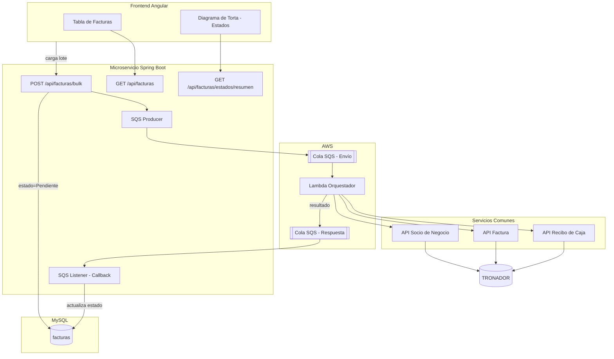
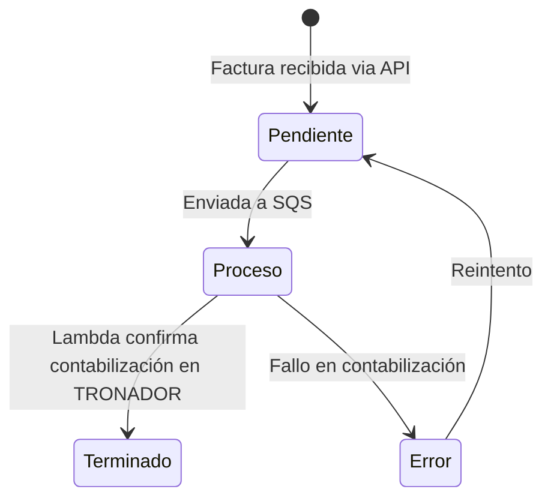

# Contexto del Proyecto - Centralizador Facturas Packs

## Descripción General

Microservicio que forma parte del ecosistema **Centralizador I&E**, encargado de recibir, persistir y gestionar el ciclo de vida de las facturas de packs. El servicio expone un API REST para la carga masiva de facturas, controla sus estados de procesamiento y orquesta el envío hacia la base de datos de **TRONADOR** a través de una cola SQS y una Lambda.

## Problema que Resuelve

Actualmente el flujo de cargue de facturas de packs requiere un punto centralizado que:
- Reciba la información de facturas validada desde archivos CSV
- Persista los registros con trazabilidad de estados
- Orqueste el envío asíncrono hacia los servicios comunes de contabilización
- Provea visibilidad del estado general del proceso mediante un dashboard

## Arquitectura

## Flujo de Estados

| Estado | Descripción |
|--------|-------------|
| **Pendiente** | Factura recibida y persistida, aún no enviada a SQS |
| **Proceso** | Factura enviada a la cola SQS, en espera de respuesta de TRONADOR |
| **Terminado** | Contabilización exitosa en TRONADOR confirmada por la Lambda |
| **Error** | Fallo en el proceso de contabilización, disponible para reintento |

## Stack Tecnológico

| Componente | Tecnología |
|------------|------------|
| Backend | Java + Spring Boot |
| Base de datos | MySQL |
| Frontend | Angular |
| Gráficos | ng2-charts (Chart.js) |
| Mensajería | AWS SQS |
| Orquestación | AWS Lambda |
| Contabilización | Servicios Comunes → TRONADOR |

## Modelo de Datos - Tabla `facturas`

| Campo | Tipo | Descripción |
|-------|------|-------------|
| id | BIGINT (PK) | Identificador único |
| cus | VARCHAR | Código CUS |
| fecha_pago | DATE | Fecha de pago |
| responsabilidad_fiscal | VARCHAR | Responsabilidad fiscal |
| tipo_documento | VARCHAR | Tipo de documento (CC, CE, etc.) |
| numero_documento | VARCHAR | Número de documento de identidad |
| nombres | VARCHAR | Nombres del cliente |
| apellidos | VARCHAR | Apellidos del cliente |
| telefono | VARCHAR | Teléfono de contacto |
| municipio | VARCHAR | Municipio |
| direccion | VARCHAR | Dirección |
| email | VARCHAR | Correo electrónico |
| valor_pack | DECIMAL | Valor del pack sin IVA |
| valor_pack_iva | DECIMAL | Valor del pack con IVA |
| comentarios | TEXT | Comentarios adicionales |
| estado | ENUM | PENDIENTE, PROCESO, TERMINADO, ERROR |
| fecha_creacion | DATETIME | Fecha de creación del registro |
| fecha_actualizacion | DATETIME | Última actualización |

## Endpoints del API

| Método | Ruta | Descripción |
|--------|------|-------------|
| POST | `/api/facturas/bulk` | Carga masiva de facturas |
| GET | `/api/facturas` | Lista paginada de facturas |
| GET | `/api/facturas/estados/resumen` | Conteo agrupado por estado |
| PUT | `/api/facturas/{id}/reintentar` | Reintento de factura en estado Error |
